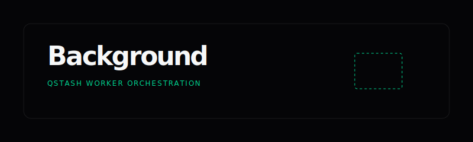

# API & Worker Architecture

<p align="center">
  
</p>

## Overview
Catalyst Scout uses a sophisticated background worker pattern to bypass the 15-30 second serverless execution limits typical of platforms like Vercel. 

## The Request Lifecycle
By treating the Next.js App Router as a webhook receiver for **Upstash QStash**, we enable agent missions that can run for several minutes without interruption.

### Sequence Diagram
```text
[Frontend]        [/api/scout]        [QStash]        [/api/worker]        [Supabase]
    │                  │                 │               │                 │
    │  1. POST Mission │                 │               │                 │
    ├─────────────────▶│                 │               │                 │
    │                  │  2. Queue Task  │               │                 │
    │                  ├────────────────▶│               │                 │
    │  3. 202 Accepted │                 │               │                 │
    │◀─────────────────┤                 │               │                 │
    │                  │                 │  4. Signed    │                 │
    │                  │                 │     Webhook   │                 │
    │                  │                 ├──────────────▶│                 │
    │                  │                 │               │  5. Persist Log │
    │                  │                 │               ├────────────────▶│
    │                  │                 │               │                 │
    │  6. WS Broadcast │                 │               │                 │
    │◀─────────────────┴─────────────────┴───────────────┴─────────────────┤
```

## Endpoints

### `POST /api/scout`
The entry point. It validates the Job Description and BYOD data, generates a unique `jobId`, and publishes the payload to the QStash queue. It returns immediately with a `202 Accepted` status.

### `POST /api/worker`
The secure background executor. 
- **Security:** Requires a valid `Upstash-Signature` header.
- **Role:** Instantiates the LangGraph agent and drives the mission to completion.
- **Admin Access:** Uses the `SERVICE_ROLE_KEY` to update mission results and logs in Supabase.

## Why this pattern?
1. **Time-Unlimited:** Agents can parse, retrieve, and simulate interviews for as long as needed.
2. **Reliability:** QStash provides automatic retries if the worker endpoint fails.
3. **User Experience:** The frontend remains responsive, receiving live updates via WebSockets while the worker handles the heavy lifting.
