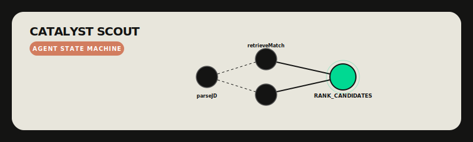

# Agent Logic Subsystem

  

## Overview
The "Brain" of Catalyst Scout is a stateful directed acyclic graph (DAG) built with **LangGraph.js**. It orchestrates the flow from raw Job Description parsing to final candidate ranking.

## The 9-Tier LLM Waterfall
To ensure zero failures, we implement a time-sliced fallback router:
1. **Tier 1-4 (Latency Optimized):** SambaNova / OpenRouter / Groq / Cerebras. If sub-second response fails or rate limits, jump to next.
2. **Tier 5-8 (Reasoning Optimized):** Gemini Powerhouse (3.1 Pro / 3 Pro / 2.5 Pro / Flash).
3. **Tier 9 (Safety Net):** Gemini 2.0 Flash fallback for 100% survival.

## Graph Nodes

| Node | Responsibility | Provider |
| :--- | :--- | :--- |
| `parseJD` | Extracts structured JSON from raw JD text. | LLM Router |
| `retrieveMatch` | Hybrid vector search (Supabase) + BYOD filtering. | pgvector / Local Embedding |
| `simulateChat` | High-fidelity 3-turn candidate interview. | Groq (Llama 3) |
| `rankCandidates` | Final scoring matrix (60% Match, 40% Interest). | LLM Scorer |

## State Management
The `AgentState` is strictly typed and persisted across the execution lifecycle, allowing the background worker to resume or retry nodes if an intermittent failure occurs.
