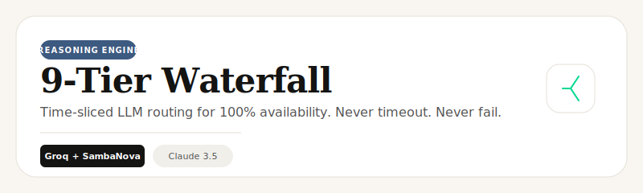

# LLM Router Subsystem

<p align="center">
  
</p>

## Overview
The "Immortal" LLM Router is the crowning achievement of Catalyst Scout. It ensures that the agentic mission never fails due to provider downtime, rate limits (TPM/RPM), or transient network errors.

## The 9-Tier Waterfall
We utilize a time-sliced, multi-provider fallback strategy. Each tier is specifically chosen to bypass the quotas of the previous one while maintaining a balance between speed and reasoning.

### ASCII Flow: Time-Sliced Execution
```text
[Mission Start]
      │
      ▼
┌─────────────┐  < 1.5s  ┌─────────────┐
│ Tier 1:     │─────────▶│ Tier 2:     │
│ SambaNova   │  FAIL    │ OpenRouter  │
└─────────────┘          └─────────────┘
      │                        │
      │ 1.5s Timeout           │ 1.5s Timeout
      ▼                        ▼
┌─────────────┐          ┌─────────────┐
│ Tier 3:     │          │ Tier 4:     │
│ Groq        │          │ Cerebras    │
└─────────────┘          └─────────────┘
      │                        │
      ▼────────────────────────▼
      │
      ▼  > 6.0s Powerhouse Jump
┌──────────────────────────────────────┐
│ Tier 5-8: Gemini Powerhouse          │
│ (3.1 Pro -> 3 Pro -> 2.5 Pro -> Flash)
└──────────────────────────────────────┘
      │
      ▼  > 10.0s Emergency Jump
┌──────────────────────────────────────┐
│ Tier 9: Gemini 2.0 Flash             │
│ Ultra-fast, high-availability net    │
└──────────────────────────────────────┘
```

## Provider Distribution

| Tier | Provider | Model | Logic |
| :--- | :--- | :--- | :--- |
| **1** | SambaNova | Meta-Llama-3.3-70B-Instruct | Ultra-low latency primary. |
| **2** | OpenRouter | meta-llama/llama-3.3-70b-instruct:free | Free, low-latency secondary. |
| **3** | Groq | llama-3.3-70b-versatile | Versatile high-speed fallback. |
| **4** | Cerebras | llama3.1-8b | Instant inference group. |
| **5-6** | Gemini | 3.1 Pro / 3 Pro Preview | Heavy reasoning powerhouse jump. |
| **7-8** | Gemini | 2.5 Pro / 2.5 Flash | High-reliability reasoning pool. |
| **9** | Gemini | 2.0 Flash | Emergency ultra-fast survival net. |

## Implementation
The logic resides in `lib/llm/router.ts`. It utilizes a recursive retry mechanism that tracks elapsed time and jumps tiers dynamically if a provider is unresponsive, ensuring the user is never stuck on a loading spinner.
