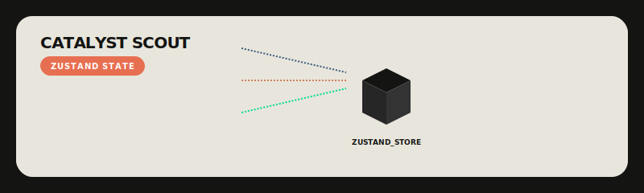

# State Management (Zustand)

  

## Overview
Catalyst Scout utilizes **Zustand** for high-performance, centralized UI state management. The store is designed to synchronize local UI state with background agent progress.

## State Recovery & Resilience
The `useScoutStore` is engineered to handle browser restarts and page refreshes gracefully during an active mission.

| Mechanism | Implementation | Role |
| :--- | :--- | :--- |
| **Session Persistence** | `sessionStorage` | Keeps the current `jobId` and `rawJD` during refreshes but clears on tab close. |
| **Log Recovery** | Supabase Fetch | On mount, `AgentTerminal` pulls historical logs from Postgres using the store's `currentJobId`. |
| **Realtime Sync** | Supabase Broadcast | New logs and results are pushed into the store via WebSocket listeners. |

## The Data Shape
The store tracks the entire mission lifecycle:
- `jobId`: The unique key for the current background worker.
- `rawJD`: The input text provided by the user.
- `logs`: An array of terminal messages (rebuilt from persistence + live stream).
- `rankedCandidates`: The final evaluated results.
- `scoutingStatus`: `idle`, `scouting`, or `completed`.

## Actions
- `startScout(jobId)`: Transition UI to active state and clear previous logs.
- `addLog(message)`: Push new events into the terminal feed.
- `addResult(candidate)`: Update the results dashboard as candidates are evaluated.
- `resetSession()`: Purge all local state for a fresh mission.

## Why Zustand?
We chose Zustand over Redux or Context API for its minimal boilerplate, direct access outside of React components (essential for our WebSocket listeners), and superior performance with high-frequency updates.
