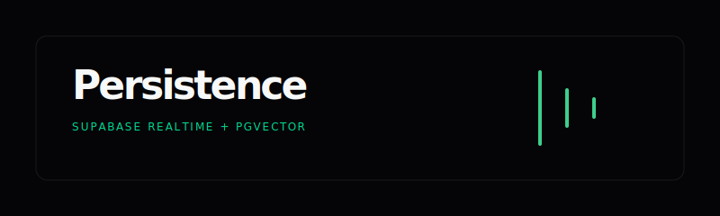

# Supabase Persistence & Real-time Logging

<p align="center">
  
</p>

## Overview
The Supabase layer serves as the persistent backbone for Catalyst Scout. It handles high-density vector retrieval, real-time agent logging, and self-cleaning maintenance tasks.

## Real-time Logging Lifecycle
We implement a "Double-Write" strategy where background workers simultaneously broadcast updates for live UI feel and persist them to a table for refresh recovery.

### ASCII Flow: Log Lifecycle
```text
┌─────────────────┐      ┌─────────────────┐      ┌──────────────────┐
│  Background     │─────▶│  Supabase Table │─────▶│  Supabase        │
│  Worker Node    │(Ins) │  (public.logs)  │(Pub) │  Realtime (WS)   │
└─────────────────┘      └────────┬────────┘      └─────────┬────────┘
                                  │                         │
                                  │                         ▼
┌─────────────────┐      ┌────────▼────────┐      ┌──────────────────┐
│  pg_cron Job    │─────▶│  Midnight       │      │  UI Terminal     │
│  (7-day expiry) │(Del) │  Cleanup        │      │  (Auto-Stream)   │
└─────────────────┘      └─────────────────┘      └──────────────────┘
```

---

## 🛠️ The Logs Schema
The `logs` table is designed for high-frequency writes and session-based retrieval.

```sql
create table logs (
    id uuid primary key default gen_random_uuid(),
    session_id text not null,
    message text not null,
    level text default 'info',
    node_name text,
    created_at timestamp with time zone default now()
);

-- Enable Realtime
alter publication supabase_realtime add table logs;
```

---

## 🔐 Security (RLS)
We enforce strict Row Level Security to ensure that while the agent can write logs, the UI can only read the necessary streams.

| Operation | Target | Logic |
| :--- | :--- | :--- |
| **SELECT** | `anon` | Enabled for session-based recovery. |
| **INSERT** | `anon` / `service_role` | Allowed for agent node persistence. |
| **DELETE** | `postgres` (Cron) | Restricted to administrative cleanup only. |

### SQL Snippet: RLS Policies
```sql
alter table logs enable row level security;

create policy "Allow anonymous read access on logs" 
  on logs for select to anon using (true);

create policy "Allow anonymous insert access on logs" 
  on logs for insert to anon with check (true);
```

---

## 🧹 Automated Maintenance (pg_cron)
To prevent database bloat and maintain performance, we use the `pg_cron` extension to automatically prune old logs.

| Task | Frequency | Action |
| :--- | :--- | :--- |
| **Log Pruning** | Daily @ 00:00 | Delete rows older than 7 days. |

### SQL Snippet: Cleanup Job
```sql
create extension if not exists pg_cron;

select cron.schedule(
  'cleanup-old-logs',
  '0 0 * * *',
  $$
  delete from public.logs
  where created_at < now() - interval '7 days';
  $$
);
```

---

## Technical Details
- **Vector Retrieval:** Handled via RPC functions for hybrid cosine similarity search.
- **WebSocket Auth:** Managed through standard Supabase anon keys scoped via `session_id`.
- **Maintenance:** Handled entirely within the database engine to reduce Next.js runtime overhead.
